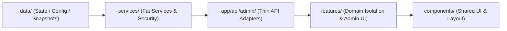

# Portfolio v2.2 — Architecture & Developer Guide

Dokumen ini merupakan **panduan arsitektur dan peta navigasi resmi** untuk pengembangan proyek **Portfolio v2.2**. Dokumen ini dirancang khusus agar mudah dipahami oleh developer baru (*Developer Experience / DX First*).

---

## 1. Project Philosophy

Pengembangan proyek ini dipandu oleh prinsip utama Engineering Constitution:

1. **Minimum Change, Maximum Clarity**: Solusi yang lebih sederhana selalu diprioritaskan dibanding abstraksi yang rumit. Lebih baik mempertahankan file berukuran sedang yang alur kodenya linier daripada memecahnya menjadi belasan mikro-file yang membingungkan navigasi.
2. **Evidence First**: Setiap optimisasi, refactoring, atau perbaikan bug **wajib diawali oleh bukti nyata**, bukan sekadar asumsi atau *best practice* spekulatif.
3. **No Speculative Refactoring**: Tidak ada pemecahan atau pengubahan kode jika kode saat ini sudah berjalan aman, rapi, dan efisien.
4. **Behavior & Visual Preservation**: Hasil render browser, antarmuka pengguna (UI), tata letak (layout), animasi, dan alur aplikasi wajib dipertahankan 100% tanpa regresi.
5. **Natural Architecture**: Susunan direktori dan penamaan file diatur secara alami sehingga mudah ditebak tanpa perlu membuka terlalu banyak tab file.
6. **Foundation Before Interface**: Seluruh fondasi service, keamanan, dan storage dibangun terlebih dahulu sebelum antarmuka pengguna (UI) dibangun.

---

## 2. Project Structure

Tanggung jawab dari setiap direktori utama dalam proyek:

```
d:\Hajat\hajaturrachman-portfolio\
├── app/                  # Next.js App Router (Halaman Rute & Endpoint API Server-side)
│   └── api/admin/        # Thin API Adapters Admin Control Center
├── components/           # Elemen UI Shared, Layar Layout, Modals, Sections, & Context Providers
│   ├── layout/           # Header Navbar, Footer, SectionHeader, & PageTransition
│   ├── modals/           # Modal interaktif (ConfirmModal, ReAuthModal, PasswordModal, dll.)
│   ├── providers/        # LanguageContext, Providers, ScrollRestoration, & PageRestoreOverlay
│   ├── sections/         # Blok section halaman utama (Hero, About, Projects, Gallery, dll.)
│   └── ui/               # Komponen UI atomik (MagneticButton, Reveal, Typewriter, ThemeToggle)
├── features/             # Fitur domain mandiri yang terisolasi (admin, cv, ecl, vault)
│   ├── admin/            # Admin Control Center UI (Dashboard, Login, & Tabs)
│   ├── cv/               # Proteksi & Modal Viewer PDF CV
│   ├── ecl/              # Materi & Audio Player German B2
│   └── vault/            # Ruang Personal Terproteksi & Memory Carousel
├── data/                 # Data adminState.json, adminSnapshots.json, & konten statis portfolio
├── services/             # Lapisan logika bisnis & verifikasi server-side (admin, auth, cv, vault, contact)
│   └── admin/            # Fat Services Admin Control Center (Auth, Toggle, Lockout, Session, Stats, Settings, Health, Strategy, Snapshot, Security)
├── docs/                 # Dokumentasi Resmi Proyek
│   ├── adr/              # Architecture Decision Records (ADR 001 - 007)
│   ├── architecture/     # Panduan Arsitektur Proyek (ARCHITECTURE.md)
│   ├── rfc/              # Technical Design RFC-000 Admin Control Center
│   ├── release/          # Dokumen Rilis & Baseline (Release Candidate, Checklists)
│   └── testing/          # Manual Test Checklist v2.2
├── hooks/                # Custom React hooks (useAudioPlayer, useAuthStatus, useModalState)
├── lib/                  # Utility helper (scroll lock, security, supabase, cn utility)
└── public/               # Aset publik statis (gambar, SVG, & dokumen PDF CV)
```

---

## 3. Data Flow

Alur data di dalam aplikasi bergerak secara konsisten dari lapisan data hingga ke antarmuka pengguna:



1. **`data/`**: Menyimpan data keadaan admin (`adminState.json`), snapshot historis (`adminSnapshots.json`), dan konten multibahasa (ID/DE).
2. **`services/`**: Mengeksekusi verifikasi token HMAC, pembatasan rate limit IP, manajemen sesi epoch, kalkulasi statistik, serta evaluasi strategi password (*Fat Services*).
3. **`app/api/admin/`**: Bertindak purely sebagai *Thin HTTP Controllers / Adapters* yang membaca request dan mengembalikan respons JSON.
4. **`features/`**: Mengelompokkan antarmuka pengguna dan domain terisolasi (`admin`, `cv`, `ecl`, `vault`).
5. **`components/`**: Menyediakan komponen UI atomik, section layout, dan dialog modal yang reusable.

---

## 4. Rendering Flow

1. **Server Rendering & Static Generation**: Rute halaman utama di-prerender secara statis oleh Next.js untuk mendapatkan waktu muat TTFB `0 ms`.
2. **Client Component Boundaries**: Komponen interaktif (seperti `ThemeToggle`, `<MagneticButton>`, `ReAuthModal`, `ConfirmModal`) ditandai dengan `"use client"` pada batas terluar.
3. **Route Transitions**: Setiap perpindahan rute dibungkus oleh `PageTransition` menggunakan `AnimatePresence` untuk memberikan animasi fade/slide yang halus.
4. **State Isolation**: State aplikasi terisolasi pada level komponen lokal sehingga re-render tidak memicu rekonsiliasi global.

---

## 5. Developer Rules

1. **Jangan Membikin Duplicate Component**: Periksa `components/ui/` dan `components/modals/` sebelum membuat komponen baru.
2. **Jangan Bypass Design System**: Selalu gunakan token Tailwind yang sudah ada (`.premium-card`, `.button-primary`, `.input`, `.section-space`, `.container-page`).
3. **Jangan Hardcode Color Tokens**: Gunakan variabel warna CSS yang mendukung Mode Gelap & Mode Terang (`rgb(var(--color-primary))`, `rgb(var(--color-surface))`).
4. **Jangan Menambah Dependensi Tanpa Alasan**: Evaluasi apakah fitur dapat diselesaikan dengan kode yang ada sebelum menginstall paket `npm` baru.
5. **Jangan Refactor Tanpa Bukti**: Setiap perbaikan wajib diawali bukti masalah nyata (*Evidence First*).
