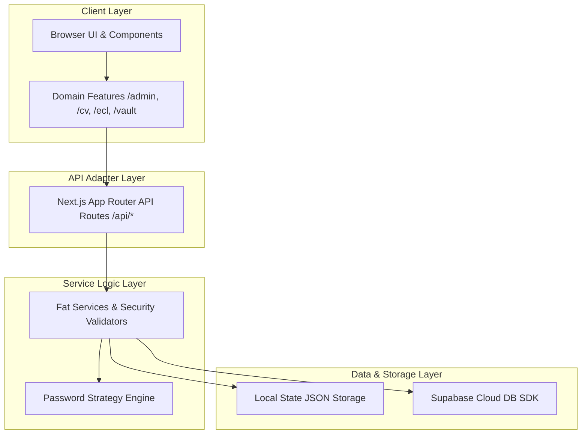

# High-Level System Architecture & Developer Guide

## 1. Architectural Philosophy

The Portfolio engineering architecture is built upon core principles designed to balance velocity, maintainability, and long-term stability:

1. **Minimum Change, Maximum Clarity**: Prefer straightforward, linear code structures over speculative abstractions. Maintain readability and predictable control flow.
2. **Evidence First**: All optimizations, refactorings, or bug fixes MUST be driven by verified real-world behavior or measurements, not assumptions.
3. **No Speculative Refactoring**: Keep existing code intact if it is running safely, cleanly, and efficiently.
4. **Behavior & Visual Preservation**: User interface rendering, design tokens, layout responsiveness, and micro-interactions must remain 100% stable without regression.
5. **Natural Domain Isolation**: Feature modules are grouped by business domain (`admin`, `cv`, `ecl`, `vault`) to prevent tight coupling across concerns.
6. **Foundation Before Interface**: Core services, security mechanisms, and data access layers are established prior to presentation components.

---

## 2. Layered System Architecture

The application adopts a clean, layered architecture separating data storage, business logic, API routing, and presentation:

### Layer Responsibilities:
- **Presentation & Features Layer (`components/`, `features/`)**: Contains atomic UI components, layout sections, interactive modals, and domain-isolated views.
- **API Adapter Layer (`app/api/`)**: Serves as thin HTTP controllers that adapt incoming requests into Service Layer calls and format standardized JSON responses.
- **Service Layer (`services/`)**: Enforces business logic, security verification, rate limiting, epoch revocation, and configuration management using `ServiceResult<T>` patterns.
- **Data & Storage Layer (`data/`, Supabase SDK)**: Manages local JSON state persistence and optional cloud database synchronization.

For a detailed file-by-file organization, see [DIRECTORY_STRUCTURE.md](file:///d:/Hajat/hajaturrachman-portfolio/docs/architecture/DIRECTORY_STRUCTURE.md).

---

## 3. Data Flow & Communication Models

Data inside the application flows in a unidirectional pattern:

1. **Local State & Persistence**: Application settings and configuration snapshot states reside in storage files managed by service repositories.
2. **Security & Validation**: Requests passing through thin API routes are validated against session cookies, rate-limit policies, and strategy engines.
3. **Cross-Tab Real-time Synchronisation**: User interactions (such as contact submissions) dispatch custom events across browser tabs via `BroadcastChannel` to update admin dashboards without full page reloads.
4. **Synchronized Epoch Revocation**: Toggling feature protections increments the global epoch, instantly invalidating outdated public session tokens.

For complete security and performance specifications, see:
- [SECURITY.md](file:///d:/Hajat/hajaturrachman-portfolio/docs/reference/SECURITY.md)
- [PERFORMANCE.md](file:///d:/Hajat/hajaturrachman-portfolio/docs/reference/PERFORMANCE.md)

---

## 4. Rendering Strategy

- **Static Pre-Rendering (SSG)**: Public portfolio routes are pre-rendered at build time for instant Time-To-First-Byte (TTFB).
- **Client Component Boundaries**: Interactive UI elements (toggles, modals, motion components) use explicit `"use client"` directives at boundary edges.
- **Micro-Interaction System**: Animations and feedback states utilize Framer Motion spring physics with isolated component re-renders.

For complete route definitions and API contracts, see:
- [ROUTES.md](file:///d:/Hajat/hajaturrachman-portfolio/docs/reference/ROUTES.md)
- [API_REFERENCE.md](file:///d:/Hajat/hajaturrachman-portfolio/docs/reference/API_REFERENCE.md)
