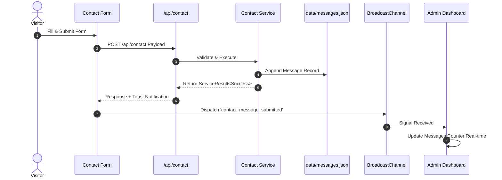
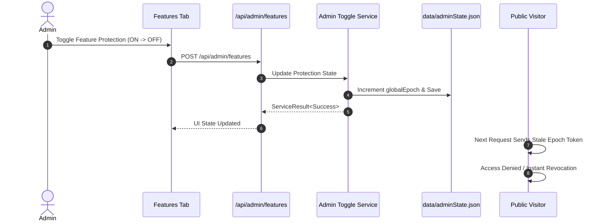

# System Overview & Subsystem Integration

This document describes the high-level system components, subsystem relationships, and operational flows across the Portfolio platform.

---

## 1. Core Subsystems

The application consists of four primary operational subsystems:

```
+-----------------------------------------------------------------------------------+
|                                 PORTFOLIO SYSTEM                                  |
+--------------------------+-----------------------------+--------------------------+
|  Public Portfolio Front  |  Protected Access Subsystem |  Admin Control Center    |
|  - Multilingual Engine   |  - Password Strategy Engine |  - Feature Toggles       |
|  - Toast & Tooltip System|  - CV & Private Vault Gate  |  - Security & Lockout    |
|  - Scroll Progress Bar   |  - Anti-Autofill Layer      |  - Snapshot History      |
+--------------------------+-----------------------------+--------------------------+
|                           Cross-Tab Synchronization Layer                         |
+-----------------------------------------------------------------------------------+
```

1. **Public Portfolio Frontend**: Handles visitor navigation, internationalization (ID/DE), contact submission, media showcase, and UI micro-interactions.
2. **Protected Access Subsystem**: Enforces multi-strategy password authentication for gated resources (`CV`, `Private Vault`, `ECL Material`).
3. **Admin Control Center**: Isolated management interface providing operational control, audit logging, feature toggles, security lockout management, and snapshot restoration.
4. **Real-time Synchronization Engine**: Coordinates client state across open browser tabs using `BroadcastChannel` events and synchronized epoch revocation.

---

## 2. Interaction Sequence Flow

### Contact Submission & Real-time Admin Notification Flow:


### Protection Toggle & Instant Public Revocation Flow:


---

## 3. Operational Guarantees

- **Zero-Downtime Feature Toggling**: Protection states update in-memory and persist to JSON without requiring server restarts.
- **Fail-Safe Fallbacks**: Local state storage falls back to safe default configurations if disk reads fail.
- **Isolation of Admin Logic**: Public routes contain zero administrative controller logic or direct file write handlers.

For detailed technical references:
- See [SECURITY.md](file:///d:/Hajat/hajaturrachman-portfolio/docs/reference/SECURITY.md) for session security protocols.
- See [FEATURE_REFERENCE.md](file:///d:/Hajat/hajaturrachman-portfolio/docs/reference/FEATURE_REFERENCE.md) for feature specifications.
