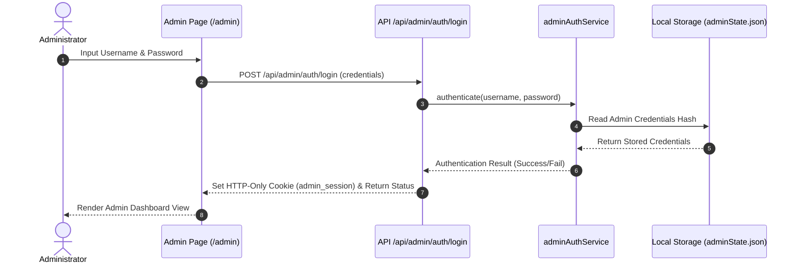
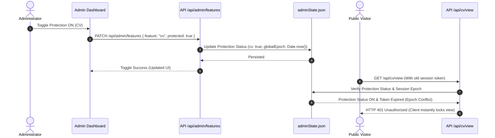
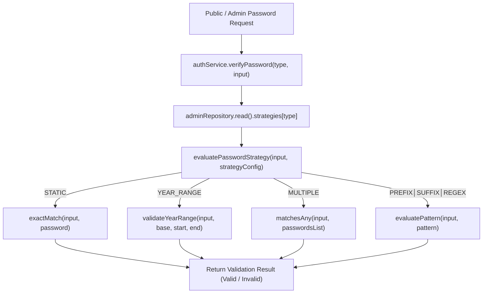
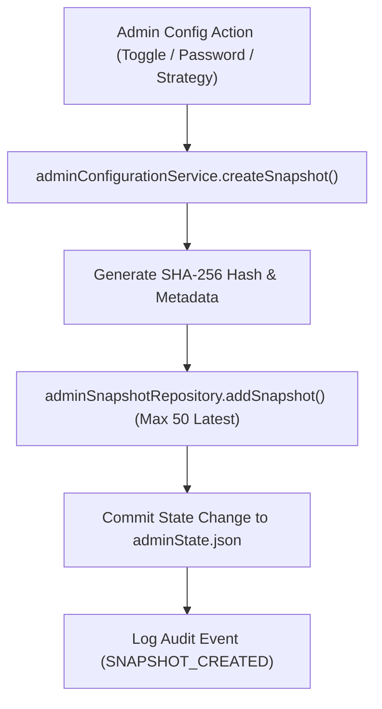
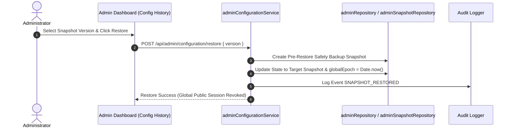

# RFC-000: Admin Control Center — Technical Design & Architecture

- **Status**: Draft / Under Review
- **Author**: Hajaturrachman Engineering Team
- **Target Release**: Portfolio v2.2
- **Baseline Reference**: Portfolio v2.1 (Frozen)
- **Target Route**: `/admin` (Internal Hidden Route)

---

## 1. Executive Summary & Context

Dengan selesainya perilisan **Portfolio v2.1** ke produksi dan dibekukannya *Golden Baseline*, siklus pengembangan berikutnya (**v2.2**) berfokus pada pembangunan **Admin Control Center**. 

Admin Control Center dirancang sebagai ruang kendali internal terisolasi yang memungkinkan pengelola situs (*Administrator*) untuk:
1. Mengubah status proteksi konten secara langsung (*Live Feature Toggle* untuk CV, Private Vault, dan ECL Material).
2. Mengelola sesi, meriset batasan percobaan salah (*lockout reset*), dan memperbarui kata sandi.
3. Memantau statistik dasar interaksi pengunjung (total unlock, total visitor, kontak masuk).
4. Mengonfigurasi pengaturan umum dan keamanan situs.

Dokumen **RFC-000** ini berfungsi sebagai **kontrak teknis dan cetak biru arsitektur resmi** untuk seluruh Pull Request (PR-001 hingga PR-007) pada rilis v2.2.

---

## 2. Engineering Constitution

Seluruh keputusan teknis di dalam RFC ini wajib mematuhi 5 prinsip konstitusi teknis:

1. **Evidence Before Change**: Setiap keputusan arsitektur harus memiliki alasan teknis dan bukti kebutuhan yang nyata.
2. **Foundation Before Interface**: Lapisan data (*storage*), keamanan (*auth/session*), dan layanan (*service layer*) dibangun dan divalidasi terlebih dahulu sebelum antarmuka pengguna (UI) dibuat.
3. **Existing Patterns Before New Patterns**: Memanfaatkan 100% pola yang telah tervalidasi pada Baseline v2.1. Tidak diperbolehkan membuat token UI, utilitas CSS, atau pustaka baru jika pola lama masih relevan.
4. **Document the Decision, Not Just the Implementation**: Mengapa suatu pendekatan dipilih dan mengapa alternatif lainnya ditolak wajib didokumentasikan secara transparan.
5. **Prefer Simplicity Over Cleverness**: Jika terdapat dua opsi teknis dengan hasil seimbang, **selalu pilih opsi yang paling sederhana, paling mudah dirawat, dan paling minim risiko**.

---

## 3. Core Requirements & System Objectives

### 3.1 Route & Discovery Policy
- **Route URL**: `/admin` (Halaman tunggal yang menangani status terautentikasi dan belum terautentikasi).
- **Discovery**: Tersembunyi penuh dari publik. Tidak ada tautan, navigasi footer, atau pengalihan otomatis dari UI publik menuju `/admin`.

### 3.2 Authentication & Session Model
- Administrator wajib melakukan autentikasi menggunakan **Username** dan **Password**.
- Sesi dikelola via HTTP-Only Secure Cookie (`admin_session`) yang ditandatangani menggunakan HMAC-SHA256.
- Fitur *Remember Login* memperpanjang usia sesi dari 2 jam (default) menjadi 30 hari.

### 3.3 Live Synchronization & Feature Toggle
- Fitur toggle membolehkan Administrator mengalihkan status proteksi (`CV`, `Vault`, `ECL`) antara **`PROTECTED` (ON)** dan **`UNPROTECTED` (OFF)**.
- **Requirement Sinkronisasi**: Jika proteksi diubah menjadi **ON** oleh Admin, seluruh pengguna publik yang sedang membuka halaman terkait akan secara otomatis kehilangan akses tanpa perlu intervensi manual dari pengguna (diimplementasikan via penyesuaian header validator API & revalidasi status ringan pada request publik berikutnya).

### 3.4 Lockout & Session Management
- Administrator memiliki akses untuk:
  1. Mereset hitungan percobaan gagal (*reset failed attempts*).
  2. Mereset timer pembekuan akses 10 menit (*reset lockout timer*).
  3. Membatalkan (*revoke*) seluruh sesi terproteksi publik secara global.

### 3.5 Statistics & Settings
- **Statistik v2.2**: Mengukur `total_visitors`, `cv_unlocks`, `vault_unlocks`, `ecl_unlocks`, dan `contact_submissions`.
- **Placeholder & UI Policy**: Menggunakan 100% Design System v2.1 (`.premium-card`, `.soft-card`, `.glass`, `<MagneticButton>`, `<Reveal>`, `.focus-ring`).

---

## 4. Proposed Architecture & System Flow

### 4.1 Component & Layer Architecture

```
d:\Hajat\hajaturrachman-portfolio\
├── app/
│   ├── admin/                        # Admin Control Center Page Route
│   │   └── page.tsx
│   └── api/
│       └── admin/                    # Admin API Endpoints
│           ├── auth/                 # Login / Logout / Session / Re-Auth
│           ├── configuration/        # History / Preview / Restore / Export
│           ├── features/             # Feature Toggle Endpoints
│           ├── health/               # System Health Endpoint
│           ├── lockout/              # Lockout Management Endpoints
│           ├── security/             # Security Overview Endpoint
│           ├── settings/             # Settings Management Endpoints
│           ├── statistics/           # Statistics Endpoints
│           └── strategies/           # Strategy Management & Validation
├── features/
│   └── admin/                        # Isolated Admin Feature Domain
│       ├── components/               # Admin UI Sections & Controls
│       │   ├── AdminLoginView.tsx
│       │   ├── AdminDashboardView.tsx
│       │   └── tabs/                 # Top Navigation Tabs
│       └── index.ts
├── services/                         # Service Layer (Foundation)
│   └── admin/                        # Fat Services Admin Domain
│       ├── adminAuthService.ts
│       ├── adminToggleService.ts
│       ├── adminLockoutService.ts
│       ├── adminSessionService.ts
│       ├── adminStatsService.ts
│       ├── adminSettingsService.ts
│       ├── adminHealthService.ts
│       ├── adminStrategyService.ts
│       ├── adminSnapshotRepository.ts
│       ├── adminConfigurationService.ts
│       └── adminSecurityService.ts
└── data/
    ├── adminState.json               # Server-Side Storage File (Local JSON Storage)
    └── adminSnapshots.json           # Configuration Snapshots Storage
```

---

### 4.2 System Sequence Diagrams

#### A. Request & Authentication Flow


#### B. Live Feature Toggle Flow & Public Sync


---

## 5. Storage Strategy & Data Schema

### 5.1 Storage Selection: Local JSON File (`data/adminState.json`)
Sesuai prinsip **Prefer Simplicity Over Cleverness** dan arsitektur v2.1 saat ini (tanpa database eksternal), data keadaan admin disimpan pada file JSON aman di sisi server: `data/adminState.json`.

- **Alasan Pemilihan**:
  1. Sangat cepat, berkinerja tinggi (`0ms` overhead jaringan).
  2. Tidak membutuhkan dependensi eksternal atau biaya layanan tambahan.
  3. Memudahkan persistensi keadaan di lingkungan server-side Node.js / Vercel KV fallback.

### 5.2 JSON Schema Contract

```json
{
  "auth": {
    "username": "Hajaturrachman10",
    "passwordHash": "Xyzordie67@", 
    "sessionSecret": "c98f02...",
    "lastPasswordChange": 1785340800000
  },
  "strategies": {
    "cv": { "type": "STATIC", "password": "cvhajat2026" },
    "vault": { "type": "STATIC", "password": "hajatprivat2026" },
    "ecl": { "type": "YEAR_RANGE", "base": "10juli", "startYear": 2006, "endYear": 2026 }
  },
  "toggles": {
    "cv": { "protected": true, "updatedAt": 1785340800000 },
    "vault": { "protected": true, "updatedAt": 1785340800000 },
    "ecl": { "protected": true, "updatedAt": 1785340800000 }
  },
  "globalEpoch": 1785340800000,
  "stats": {
    "totalVisitors": 1420,
    "cvUnlocks": 128,
    "vaultUnlocks": 45,
    "eclUnlocks": 89,
    "contactSubmissions": 12
  }
}
```

---

## 6. API Design Specification

| Endpoint | Method | Security | Description | Payload Input | Response Output |
| :--- | :--- | :--- | :--- | :--- | :--- |
| `/api/admin/auth/login` | `POST` | Public / Rate-Limited | Autentikasi Login Admin | `{ username, password, remember }` | `{ success: true, user: "admin" }` |
| `/api/admin/auth/logout` | `POST` | Admin Session | Hapus Sesi Admin | `{}` | `{ success: true }` |
| `/api/admin/auth/session` | `GET` | Admin Session | Cek Status Sesi Login | None | `{ authenticated: true }` |
| `/api/admin/auth/re-auth` | `POST` | Admin Session | Verifikasi Re-Autentikasi Action | `{ password }` | `{ success: true, verified: true }` |
| `/api/admin/features` | `GET / PATCH` | Admin Session | Baca & Ubah Feature Toggle | `{ feature, protected }` | `{ success: true, toggles: {...} }` |
| `/api/admin/lockout/reset` | `POST` | Admin Session (Level 3) | Reset Lockout & Attempts | None | `{ success: true, reset: true }` |
| `/api/admin/settings` | `GET / POST` | Admin Session (Level 3) | Perbarui Username / Password Admin | `{ action, value }` | `{ success: true }` |
| `/api/admin/configuration/history` | `GET` | Admin Session | List Snapshot Konfigurasi | None | `{ success: true, snapshots: [...] }` |
| `/api/admin/configuration/restore` | `POST` | Admin Session (Level 3) | Restore Snapshot Target | `{ version }` | `{ success: true }` |
| `/api/admin/configuration/export` | `POST` | Admin Session | Unduh Cadangan Config JSON | None | Attachment JSON File |
| `/api/admin/security` | `GET` | Admin Session | Overview Keamanan & Activity | None | `{ success: true, security: {...} }` |

---

## 7. Security Model & Session Management

1. **Authentication Token**: HMAC-SHA256 Signed Cookie `admin_session`.
2. **Brute-Force Protection**: Maksimal 5 kali percobaan salah pada login admin sebelum IP dibekukan selama 15 menit.
3. **Session Revocation (Global Epoch)**: Mengubah `globalEpoch` pada file `adminState.json` secara seketika akan membatalkan seluruh cookie publik yang dibuat sebelum timestamp tersebut.
4. **Cache Control**: Seluruh rute API `/api/admin/*` menyertakan header `Cache-Control: no-store, max-age=0` untuk mencegah kebocoran buffer di CDN atau browser cache.

---

## 8. Configurable Authentication Strategy Engine (PR-006A)

### 8.1 Admin Credentials Case Rules
- **Admin Username**: **Case-Insensitive** via `normalize(username)` (`username.trim().toLowerCase()`). Contoh: `Hajaturrachman10`, `hajaturrachman10`, dan `HAJATURRACHMAN10` diakui sama.
- **Admin Password**: **Case-Sensitive Exact Match** menggunakan perbandingan waktu konstan `timingSafeCompare` (Default: `Xyzordie67@`).

### 8.2 Universal Password Strategy Flow Diagram


### 8.3 Cara Menambahkan Strategi Password Baru Tanpa Mengubah UI
1. **Tambahkan Tipe Strategi di `passwordEngine.ts`**:
   Tambahkan varian baru pada type `PasswordStrategyConfig` (misalnya `{ type: "CUSTOM_HASH"; algorithm: string }`).
2. **Tambahkan Logic Evaluasi di `evaluatePasswordStrategy`**:
   Tambahkan `case` baru pada fungsi `evaluatePasswordStrategy`.
3. **Otomatis Dikenali UI**:
   Komponen `AdminSettingsTab.tsx` dan `Preview Validator` akan secara otomatis mengeksekusi strategi baru tanpa perlu mengubah kode antarmuka.

---

## 9. Configuration Versioning & Safe Configuration Workflow (PR-006B)

### 9.1 Snapshot Lifecycle


### 9.2 Restore Flow


### 9.3 Configuration Metadata Schema
- `version`: Nomor urut snapshot (1, 2, 3, ...).
- `createdAt`: Timestamp milisekon pembuatan.
- `createdBy`: Nama pengguna admin pencipta snapshot.
- `message`: Alasan/deskripsi perubahan konfigurasi.
- `configHash`: Nilai hash SHA-256 dari serialized configuration.
- `state`: Objek keadaan `AdminState` lengkap.

---

## 10. Security Hardening & Operational Safety (PR-006C)

### 10.1 Dangerous Action Safety Classification
- **Level 1 (Informational)**: Langsung dieksekusi tanpa dialog konfirmasi.
- **Level 2 (Confirmation Required)**: Membutuhkan konfirmasi `ConfirmModal`.
- **Level 3 (Confirmation + Re-authentication)**: Membutuhkan verifikasi kata sandi admin aktif via `ReAuthModal` sebelum eksekusi.

### 10.2 Idle Session Inactivity Policy
Sesi admin akan di-logout otomatis jika tidak ada interaksi pengguna (`mousemove`, `keydown`, `click`, `scroll`, `touchstart`) dalam tenggat waktu **30 menit**.

### 10.3 Configuration Export Metadata
Ekspor konfigurasi `.json` menyertakan metadata rilis, timestamp, hash SHA-256, strategi password, toggle, dan statistik, serta disiapkan untuk kompatibilitas impor pada rilis v2.3.

---

## 11. Decision Log (RFC Architecture Decisions)

### Decision 1: Penempatan Rute Admin (`/admin` Hidden Route vs Aplikasi Terpisah)
- **Reason**: Membuat aplikasi terpisah menambah overhead maintenance dan menduplikasi Design System. Rute tersembunyi `/admin` menghemat 100% beban perawatan.
- **Alternatives Considered**: Subdomain terpisah (`admin.hajat.vercel.app`) atau repositori terpisah.
- **Trade-offs**: Rute `/admin` harus dipastikan tidak memiliki tautan publik.
- **Final Decision**: Menggunakan rute tersembunyi `/admin` di dalam repositori utama.

### Decision 2: Pendekatan Live Synchronization (Global Epoch Invalidation vs WebSockets)
- **Reason**: WebSockets memerlukan server berjangka panjang (*long-running process*) yang tidak didukung secara native pada arsitektur serverless Vercel. Epoch timestamp validation pada header API publik memberikan hasil instan tanpa infrastruktur tambahan.
- **Alternatives Considered**: WebSockets / Server-Sent Events (SSE) vs Client Long-Polling.
- **Trade-offs**: Pengguna publik yang sedang membuka halaman akan kehilangan akses saat request API berikutnya terjadi.
- **Final Decision**: Menggunakan Epoch Timestamp Validation pada API publik.

### Decision 3: Lapisan Penyimpanan (Local JSON File vs External Database)
- **Reason**: Database eksternal menambah latensi jaringan dan kompleksitas dependensi. File JSON lokal di server memberikan performa tercepat dan mudah dimigrasikan.
- **Alternatives Considered**: Supabase PostgreSQL vs Redis / Upstash vs Local JSON Storage.
- **Trade-offs**: Persistensi berbasis file lokal di lingkungan Vercel memerlukan fallback sync ringan.
- **Final Decision**: Menggunakan Local JSON File (`data/adminState.json`) dengan skema terstruktur.

---

## 12. Final Acceptance Criteria

RFC-000 ini dinyatakan selesai dan disetujui apabila:
- [x] Seluruh keputusan teknis utama didokumentasikan beserta alasan dan alternatifnya.
- [x] Mengikuti 100% **Engineering Constitution** & filosofi *Minimum Change, Maximum Clarity*.
- [x] Menjamin 100% paritas **Design System Baseline v2.1**.
- [x] Menjadi acuan tunggal yang siap dieksekusi dari **PR-001** hingga **PR-007**.
